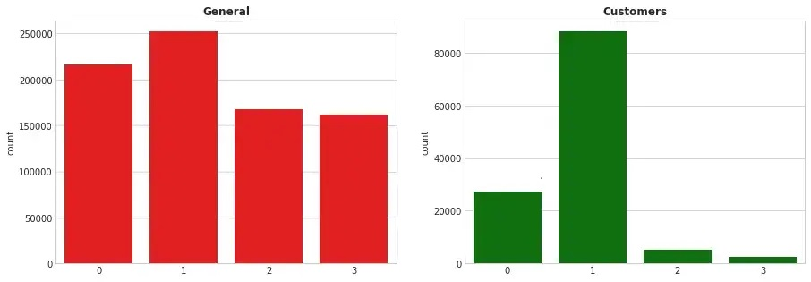

# Timmtet_Portfolio
# Hi, I am Timileyin Akintilo. Welcome to my portfolio.

# [Project 1: Writing a Data Science Blog Post - (TMDb_movies_database Project)](https://github.com/Timmtet/Write-a-data-science-blog-post)
1. Installations

There should be no necessary libraries to run the code here beyond the Anaconda distribution of Python. The code should run with no issues using Python versions 3.

2. Project Motivation

The aim of the project is to investigate and write a blog post on the factors that positive and negatively affects revenue generation from movie production. Hence, the following questions were considered:

a. What is the association between movies with tagline and revenue/adjusted revenue(renvenue_adj)

b. What decade are the most popular movies released; how much revenue was recorded that year?

c. Does higher vote count have any influence on revenue generated?

3. File Description

For this project, I chose a dataset of my own, which is the TMDb movie dataset. This data set contains information over 10,000 movies collected from The Movie Database (TMDb), including user ratings and revenue. The database has 10866 rows and 21 columns. The columns include: Id, imdb_id, popularity, budget, revenue, original_title, cast, homepage, director, tangline, overview, runtime, genre, production_company, release_date, vote_count, vote_average, release_year, budject_adj, and revenue_adj.
There is also a notebook available here to showcsae all my work related to my three questions.

4. Results

The insights drawn from this project can be found in the medium post below:
[How to maximize revenue in your next movie production: Insights from The Movie Database (TMDb)](https://medium.com/@akintilotimileyin/how-to-maximize-revenue-in-your-next-movie-production-insights-from-the-movie-database-tmdb-c3e0c932dda1)

5. Licensing, Authors, and Acknowledgements

Must give credit to my collegues for thier inputs in this project, and to kaggle for the data. You can find the Licensing for the data and other descriptive information at the Kaggle link available below:
https://www.kaggle.com/datasets/tmdb/tmdb-movie-metadata

# [Project 2: Capstone Project](https://github.com/Timmtet/Capstone-Project1)
1. Project Overview

In this project, we are provided with demographic data of customers of a mail-order company in Germany and demographic data of general population of Germany. Using this data, we are required to identify new customers for the company

This project is divided into the steps, namely:

a. Customer Segmentation using Unsupervised Learning, in this part a thorough data analysis and feature engineering steps are performed to prepare the data for further steps. A Principal Component Analysis (PCA) is performed for dimensionality reduction. Then K-Means Clustering is performed on the PCA components to cluster the general population and the customer population into different segments. These clusters are studied to determine what features make a customer with the help of cluster weights and component weights.

b. Customer Acquisition using Supervised Learning, This used the previous analysis to build a machine learning model that predicts whether or not each individual will respond to the campaign.

c. Kaggle Competition - This used the chosen model to make predictions on the campaign data as part of a Kaggle Competition and see how it measures up to the other fellow students.

2. Data Files

There were four data files provided by Arvato for this project. The last file was created by the user. As part of the terms and conditions of Arvato, the files cannot be shared in this repository. However, they can be described below.

azdias.csv - Demographics data for the general population of Germany, customers.csv - Demographics data for customers of a mail-order company, mailout_train.csv - Demographics data for individuals who were targets of a marketing campaign (train), mailout_test.csv - Demographics data for individuals who were targets of a marketing campaign (test), feat_info.csv - Contains a summary of properties for each demographics data column created by the user 

3. Technical Overview

The project has been divided into various steps which include:

Data Exploration, Data Wrangling, Feature Engineering, Dimensionality Reduction, Clustering, Supervised Learning, Model Evaluation, Predictions on Test data, Kaggle Submission

4. Requirements

All of the requirements are given in requirements.txt. To install Run: pip install -r requirements.txt

5. Results

The results have been clearly documented in the Jupyter Notebook. Please refer Arvato Project Workbook.ipynb.

The blog post for this project is found in the meduim post below:
[Capstone Project: Customer Segmentation.](https://medium.com/@akintilotimileyin/capstone-project-customer-segmentation-5f2844515909)

# [Project 3: Heart disease Prediction Project](https://github.com/Timmtet/Kagggle-Heart-Prediction-Project)

Cardiovascular diseases (CVDs) are the number 1 cause of death globally, taking an estimated 17.9 million lives each year, which accounts for 31% of all deaths worldwide. Four out of 5CVD deaths are due to heart attacks and strokes, and one-third of these deaths occur prematurely in people under 70 years of age. Heart failure is a common event caused by CVDs and this dataset contains 11 features that can be used to predict a possible heart disease.

People with cardiovascular disease or who are at high cardiovascular risk (due to the presence of one or more risk factors such as hypertension, diabetes, hyperlipidaemia or already established disease) need early detection and management wherein a machine learning model can be of great help.

This project involves the building of a predictive model that will help in clasification of patients into those at high cardiovascular risk(with cardiovascular disease) and those at low cardiovascular risk(without cardiovascular disease).

.png)

# [Project 4: Financial Inclusion in Africa](https://github.com/Timmtet/Financial-Inclusion-in-Africa-/blob/main/Zindi%20Financial%20inclusion%20.ipynb)
Financial inclusion remains one of the main obstacles to economic and human development in Africa. For example, across Kenya, Rwanda, Tanzania, and Uganda only 9.1 million adults (or 14% of adults) have access to or use a commercial bank account.

Traditionally, access to bank accounts has been regarded as an indicator of financial inclusion. Despite the proliferation of mobile money in Africa, and the growth of innovative fintech solutions, banks still play a pivotal role in facilitating access to financial services. Access to bank accounts enable households to save and make payments while also helping businesses build up their credit-worthiness and improve their access to loans, insurance, and related services. Therefore, access to bank accounts is an essential contributor to long-term economic growth.

In this project a machine learning model was created to predict which individuals are most likely to have or use a bank account. The models and solutions developed provided an indication of the state of financial inclusion in Kenya, Rwanda, Tanzania and Uganda, while providing insights into some of the key factors driving individuals’ financial security.

# [Link to other projects](https://github.com/Timmtet?tab=repositories)
